<div align="center">

<!-- ═══════════════ 👿 DEMON BANNER (demon-header.svg repo ma hovi joiye!) ═══════════════ -->



<!-- ═══════════════ TYPING ANIMATION STACK ═══════════════ -->


<!-- ═══════════════ MATRIX LINE ═══════════════ -->


</div>

<div align="center">

<!-- ═══════════════ BADGES ═══════════════ -->


&nbsp;

&nbsp;


<br><br>


&nbsp;

&nbsp;


</div>


<!-- ═══════════════ CYBER CORE — FIXED NAME ═══════════════ -->

# 👿 CYBER CORE

<div align="center">

```text
███╗   ██╗██╗██╗  ██╗██╗  ██╗██╗██╗
████╗  ██║██║██║ ██╔╝██║  ██║██║██║
██╔██╗ ██║██║█████╔╝ ███████║██║██║
██║╚██╗██║██║██╔═██╗ ██╔══██║██║██║
██║ ╚████║██║██║  ██╗██║  ██║██║███████╗
╚═╝  ╚═══╝╚═╝╚═╝  ╚═╝╚═╝  ╚═╝╚═╝╚══════╝

███████╗ █████╗ ██╗     ██████╗ ██╗   ██╗
██╔════╝██╔══██╗██║     ██╔══██╗██║   ██║
█████╗  ███████║██║     ██║  ██║██║   ██║
██╔══╝  ██╔══██║██║     ██║  ██║██║   ██║
██║     ██║  ██║███████╗██████╔╝╚██████╔╝
╚═╝     ╚═╝  ╚═╝╚══════╝╚═════╝  ╚═════╝
```


</div>


<!-- ═══════════════ ABOUT ═══════════════ -->

# 💀 SYSTEM PROFILE


```yaml
Name        : Nikhil Faldu
Role        : Full Stack Software Engineer
Company     : Trividhya Innovation Pvt. Ltd.
Location    : Gujarat, India

Focus:
  - Enterprise Applications
  - ERP Systems
  - CRM Platforms
  - AI Integrations
  - Cloud Solutions
  - REST APIs

Mission:
  - Build scalable software
  - Improve architecture
  - Learn modern technologies

Status      : ⚡ ONLINE — BUILD MODE ACTIVE
```

<br clear="right"/>

<div align="center">

> 🩸 *"Code should solve real problems."*
> 💀 *"Clean architecture beats clever code."*
> ⚡ *"Keep learning. Keep building."*

</div>


<!-- ═══════════════ TECH STACK ═══════════════ -->

# ⚡ WEAPON ARSENAL

<div align="center">

### 🩸 FRONTEND STRIKE FORCE


### 💀 BACKEND WAR MACHINE


### 🗄️ DATA VAULT


### ☁️ CLOUD COMMAND


### 🧠 AI / ML CORE


### 📱 MOBILE OPS


### ⚙️ MESSAGE QUEUE & DEVTOOLS


### 🛠️ DAILY GEAR


</div>


<!-- ═══════════════ HACKER LAB ═══════════════ -->

# 👿 HACKER LAB — SECURITY OPS

<div align="center">


<br>


<br><br>


<br>


</div>

```text
╔════════════════════════════════════════════════╗
║  🛡️  SECURITY PROTOCOL                         ║
╠════════════════════════════════════════════════╣
║  ✔ OWASP Top 10                                ║
║  ✔ JWT / OAuth 2.0 Authentication              ║
║  ✔ REST API Security                           ║
║  ✔ Linux Hardening                             ║
║  ✔ Network Analysis                            ║
║  ✔ Ethical Hacking (Lab Practice)              ║
║  ✔ Secure Backend Architecture                 ║
╚════════════════════════════════════════════════╝
```


<!-- ═══════════════ SPECIALIZATION ═══════════════ -->

# ⚔️ COMBAT SPECIALIZATION

<div align="center">

| 💀 DOMAIN | 🔥 POWER LEVEL |
|:---------:|:--------------:|
| Enterprise Software | ██████████ 100% |
| ERP Development | ██████████ 100% |
| CRM Development | ██████████ 100% |
| REST APIs | ██████████ 100% |
| Authentication & Security | ██████████ 100% |
| Payment Gateway | ██████████ 100% |
| Database Design | ██████████ 100% |
| Cloud Deployment | ████████░░ 85% |
| Docker & DevOps | ████████░░ 85% |
| AI Integration | ████████░░ 85% |

</div>


<!-- ═══════════════ AI ECOSYSTEM ═══════════════ -->

# 🤖 AI NEURAL NETWORK

<div align="center">


| 🧠 AI | ⚡ USAGE | 💀 STATUS |
|:-----:|:--------:|:---------:|
| ChatGPT | Daily | 🟢 ACTIVE |
| Claude | Daily | 🟢 ACTIVE |
| Gemini | Daily | 🟢 ACTIVE |
| Cursor AI | Daily | 🟢 ACTIVE |
| DeepSeek | Daily | 🟢 ACTIVE |
| Ollama | Local AI | 🟢 ACTIVE |
| MCP | AI Workflow | 🟢 ACTIVE |

</div>


<!-- ═══════════════ EXPERIENCE ═══════════════ -->

# 🚀 MISSION LOG

<div align="center">

## 💼 Full Stack Software Engineer
### 🏢 Trividhya Innovation Pvt. Ltd.

</div>

```text
╔════════════════════════════════════════════════╗
║  ACTIVE OPERATIONS                             ║
╠════════════════════════════════════════════════╣
║  ✔ Enterprise ERP Systems                      ║
║  ✔ CRM Platforms                               ║
║  ✔ AI Integrations                             ║
║  ✔ REST APIs                                   ║
║  ✔ Cloud Applications                          ║
║  ✔ Admin Panels                                ║
║  ✔ Authentication Systems                      ║
║  ✔ Payment Integrations                        ║
║  ✔ Docker Deployments                          ║
╚════════════════════════════════════════════════╝
```


<!-- ═══════════════ DEV FLOW ═══════════════ -->

# ⚡ KILL CHAIN — DEV FLOW

<div align="center">

```text
 IDE ──▶ DESIGN ──▶ ARCHITECTURE ──▶ FRONTEND ──▶ BACKEND
                                                     │
 PRODUCTION ◀── CLOUD ◀── DOCKER ◀── API ◀── DATABASE
```

</div>


<!-- ═══════════════ GITHUB STATS ═══════════════ -->

# 📈 BATTLE STATISTICS

<div align="center">


<br><br>


<br><br>


</div>


<!-- ═══════════════ TROPHIES ═══════════════ -->

# 🏆 WAR TROPHIES

<div align="center">


</div>


<!-- ═══════════════ METRICS ═══════════════ -->

# 📊 DEEP SCAN METRICS

<div align="center">


<br>


</div>


<!-- ═══════════════ SNAKE ═══════════════ -->

# 🐍 CONTRIBUTION HUNTER

<div align="center">


</div>


<!-- ═══════════════ MINDSET ═══════════════ -->

# 💀 CORE PROTOCOL

```javascript
class NikhilFaldu extends Engineer {
    constructor() {
        super();
        this.mode = "BEAST";
        this.coffee = Infinity;
    }

    async dailyProtocol() {
        while (this.alive) {
            await this.learn();      // 🧠 absorb knowledge
            await this.architect();  // 📐 design systems
            await this.build();      // ⚡ write clean code
            await this.deploy();     // 🐳 docker + cloud
            await this.improve();    // 🔥 level up
        }
    }
}

new NikhilFaldu().dailyProtocol(); // ♾️ RUNNING...
```


<!-- ═══════════════ GOALS ═══════════════ -->

# 👿 NEXT TARGETS

<div align="center">

| 🎯 TARGET | 📡 STATUS |
|:---------:|:---------:|
| AI Agents | 🔴 HUNTING |
| MCP Workflows | 🔴 HUNTING |
| Kubernetes | 🔴 HUNTING |
| System Design | 🔴 HUNTING |
| Microservices | 🔴 HUNTING |
| AWS / Azure Mastery | 🔴 HUNTING |
| DevOps Pipeline | 🔴 HUNTING |

</div>


<!-- ═══════════════ TERMINAL ═══════════════ -->

# 👿 ROOT TERMINAL

```bash
root@nikhilfaldu:~# whoami
> nikhilfaldu

root@nikhilfaldu:~# cat role.txt
> Full Stack Software Engineer @ Trividhya Innovation

root@nikhilfaldu:~# ./scan --stack
> [██████████] Laravel  ✔
> [██████████] Next.js  ✔
> [██████████] Node.js  ✔
> [████████░░] AI/Cloud ⚡ upgrading...

root@nikhilfaldu:~# systemctl status nikhil
> ● nikhil.service — ACTIVE (running) 🟢
> Build Mode : ENGAGED
> AI Mode    : ENABLED
> Coffee     : LOADING... ☕

root@nikhilfaldu:~# _
```


<!-- ═══════════════ CONNECT ═══════════════ -->

# 🌍 ESTABLISH CONNECTION

<div align="center">

<a href="https://github.com/nikhilfaldu">

</a>
&nbsp;
<a href="https://linkedin.com/in/nikhil-faldu">

</a>

<br><br>

> 💀 *"Great software is not written by chance.*
> *It is built with patience, architecture and obsession."*

</div>


<!-- ═══════════════ FOOTER ═══════════════ -->

<div align="center">


</div>
